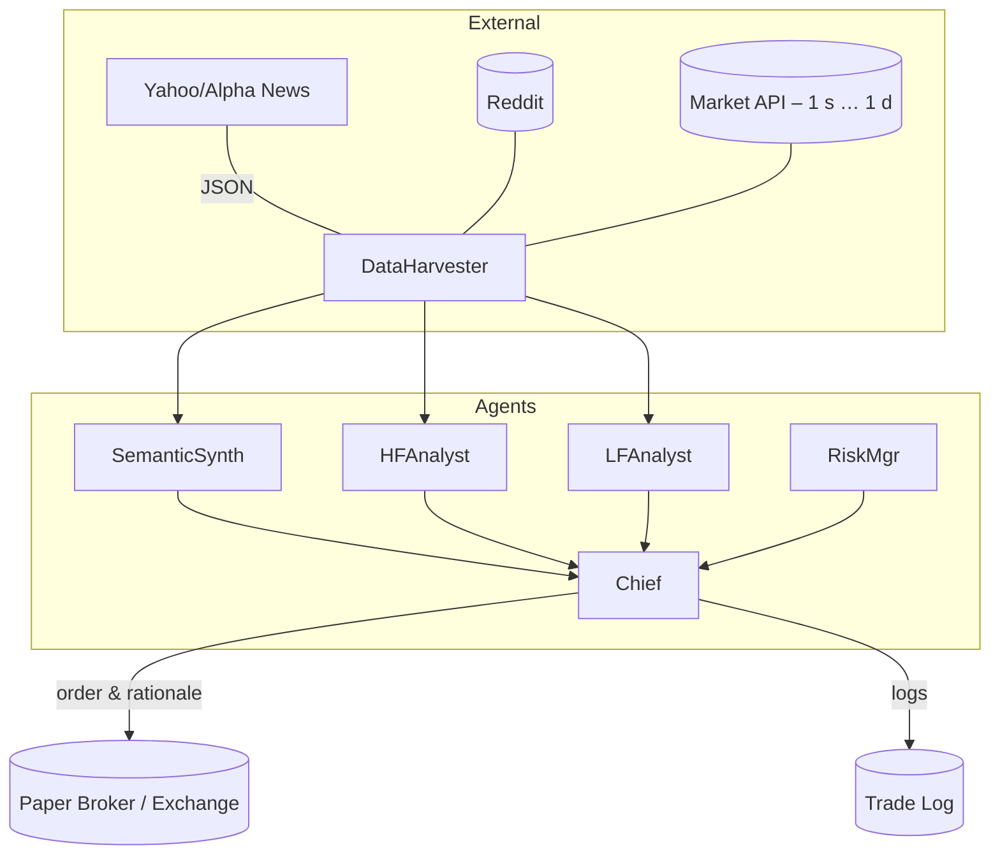

# Multi-Agent Trading Orchestrator – Learning-Centric Plan

## 0. Why This Exists
I want a sandbox where **any ML model that emits trade signals can be plugged in** and evaluated in a realistic, end-to-end loop.  A team of specialised agents will gather data, run the models, combine the evidence, and let an executive agent decide whether to trade.

## 1. High-Level Architecture

* **DataHarvester** – one process, many connectors. Pulls both numerical market data (user-selectable symbol & timeframe) and textual news/social data, stores raw feeds.
* **SemanticSynth** – turns raw text into embeddings + sentiment metrics (FinBERT/VADER/GPT-4o).
* **HFAnalyst** – "High-frequency" analyst; runs any plug-in model on 1 s-1 min candles.
* **LFAnalyst** – "Low-frequency" analyst; same idea but on 15 min-1 day bars.
* **RiskMgr** – maintains position PnL, max drawdown, capital usage, feeds risk flags to Chief.
* **Chief** – executive agent; merges all signals & risk state, decides **LONG / SHORT / FLAT**, emits trade size and a short reasoning string.

## 2. Plug-in Model Interface (MVP)
```python
# models/<model_name>/model.py
class TradeModel:
    def __init__(self, config: dict):
        ...

    def predict(self, features: pd.DataFrame) -> dict:
        """Return {timestamp, signal: -1|0|1, confidence: 0-1} """
```
* Drop the file in `models/<name>/`, declare it in `models/__init__.py`; agents discover via entry points.
* Compatible with scikit-learn, PyTorch, LightGBM, or even a REST call – as long as `predict` returns the dictionary above.

## 3. Agent Toolbelt
| Tool | Purpose | Who can call |
|------|---------|-------------|
| `MarketAPI` | pull OHLCV for symbol & timeframe | DataHarvester |
| `NewsAPI` / `RedditAPI` | fetch text | DataHarvester |
| `SentimentLLM` (GPT-4o on OpenRouter) | classify / summarise text | SemanticSynth |
| `VectorStore` | save embeddings | SemanticSynth, Analysts |
| `ModelRunner` | load & run plug-in models | HFAnalyst, LFAnalyst |
| `SQLTradeLog` | store executed trades | Chief, RiskMgr |
| `Broker` | paper-trade REST | Chief |

Implementation: Python 3.11, `openai` SDK (pointed at OpenRouter), **custom asyncio orchestration (no LangChain)**, `pandas` & `polars` for data, `chromadb` for embeddings, `sqlmodel` for relational logs.

## 4. Phase Plan (Learning-First)
1. **Foundations**  
   – Repo, venv/Poetry, Docker.  
   – `.env` with API keys (OpenRouter, Polygon, Alpha).
2. **Data Connectors**  
   – MarketAPI wrapper (yfinance for equities, FTX/Bybit for crypto, etc.).  
   – Reddit & Yahoo collectors (done!).
3. **Sentiment Pipeline**  
   – FinBERT baseline, GPT-4o classifier via `SentimentLLM` tool.  
   – Embedding store.
4. **Model Plug-in API**  
   – Implement `TradeModel` interface.  
   – Provide two sample models: moving-average cross & simple LightGBM.
5. **Agent Prototypes**  
   – HFAnalyst loads sample model, outputs signals every minute.  
   – LFAnalyst runs hourly.  
   – SemanticSynth produces sentiment score vector every 15 min.
6. **Chief + RiskMgr**  
   – "Rule-of-thumb" ensemble: majority vote, risk guardrails.  
   – Paper-trade in SQLite.
7. **Evaluation Dashboard**  
   – Jupyter / Streamlit: equity curve, Sharpe, hit-rate, confusion matrix of signals.  
   – Compare plug-ins easily.
8. **Stretch**  
   – FastAPI endpoints `/predict`, `/agents/status`.  
   – Live Discord or Slack notifications.

## 5. Directory Skeleton
```
project/
├─ tools/
│  ├─ data_collectors/
│  ├─ agents/
│  ├─ models/        # plug-in folders
│  └─ utils/
├─ data/
│  ├─ raw/
│  └─ processed/
├─ notebooks/
└─ tests/
```

## 6. What I Still Need to Learn / Decide
- Best orchestration lib: `langgraph` vs. `CrewAI` vs. plain asyncio.  
- How Chief fuses heterogenous signals (Bayesian model? weighted voting?).  
- Risk budgeting maths (Kelly, CVaR?).  
- Scaling beyond one symbol.

## 7. Success Criteria
1. Any new model dropped into `models/` can be selected via a config and run without code changes.  
2. Chief agent logs reasoning, action, and PnL for each decision.  
3. Clear comparison of performance with/without sentiment features.  
4. I understand the trade-offs and can explain each agent's role.

